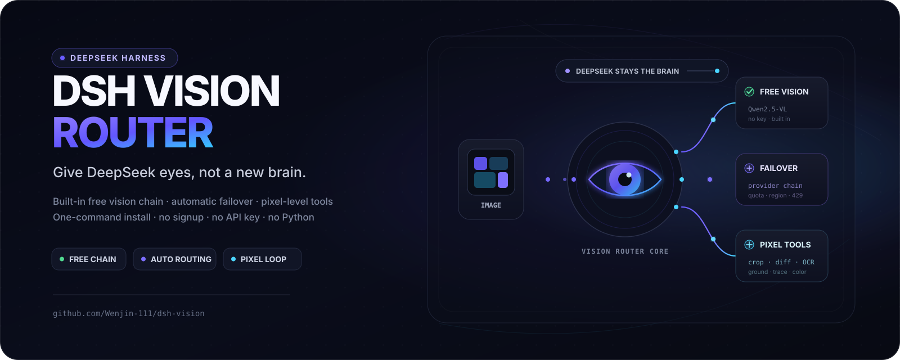
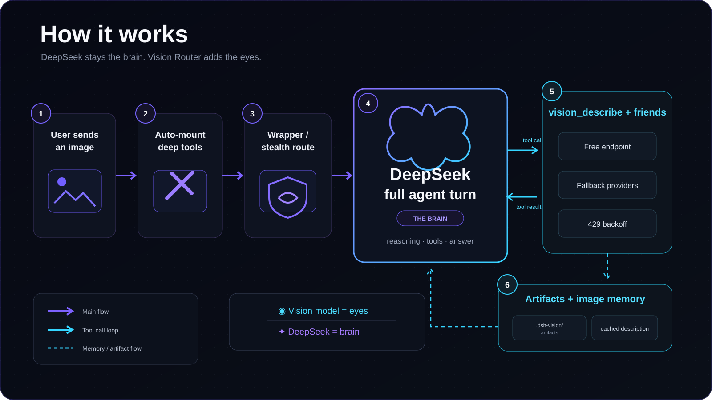
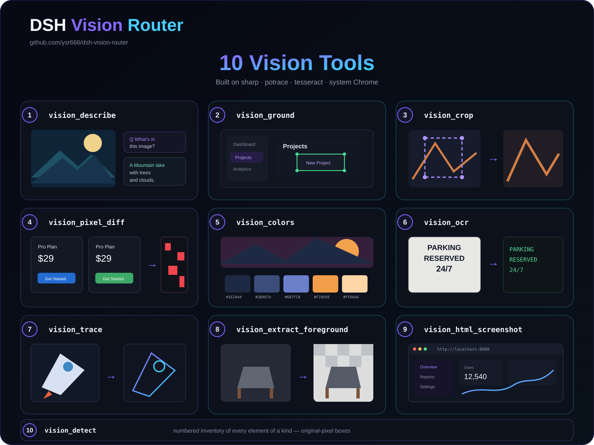

# dsh-vision

Give DeepSeek eyes, not a different brain.

`dsh-vision` is a vision-routing plugin for [DeepSeek Harness (DSH)](https://github.com/deepseek-ai): turns that contain an image run on a vision model (with raw pixel access), while plain-text turns keep the session's own model. It ships with a built-in free, keyless vision chain with automatic failover, plus a set of pixel-level vision tools (image Q&A, grounding, crop, pixel diff, color extraction, OCR, vectorization, background removal, page screenshots).

One-command install · No signup · No API key · No Python




## Features

- **Turn-level vision routing** — the turn that contains an image (a user upload, or a mid-turn tool result like `read_image`) runs entirely on the vision model; every other turn keeps the session model. DeepSeek stays the "brain" — reasoning, tools, answering.
- **Built-in free vision chain** — defaults to OVHcloud AI Endpoints' `Qwen2.5-VL-72B-Instruct`, anonymous, keyless, zero-config. Explicitly configured `httpProviders` override the default.
- **Automatic failover** — the vision model chain falls back in order (quota, region, 429, …); when every vision model fails in one turn the next attempt raises a classified, actionable error.
- **10 pixel-level vision tools** — built on `sharp` / `potrace` / `tesseract` / system Chrome. Auto-mounted on image turns; mount them manually on text-only turns via `vision_activate`.
- **Auto downscale & answer cache** — images beyond the pixel budget are resized before the vision call; answers are cached by image content + question (LRU + TTL).
- **Stealth mode** — takes over the official DeepSeek route while the model picker looks exactly like stock.
- **Per-host proxy** — an optional `proxy` routes only the domains in `proxyHosts` through it; everything else (DeepSeek and the rest) stays direct.

## How it works



1. The user sends an image.
2. Deep vision tools are auto-mounted.
3. The wrapper / stealth route hands the image turn to the vision model (agent / pre-step); text turns still go through `deepseek-official`.
4. DeepSeek, the "brain", runs a full agent turn (reasoning · tools · answering).
5. When the model needs to look at an image it calls `vision_describe` and friends, through the free endpoint / fallback providers (with 429 backoff).
6. Artifacts and image memory land in `.dsh-vision/artifacts`; descriptions are cached.

> ◉ Vision model = the eyes　✦ DeepSeek = the brain

## Quick start

```bash
dsh plugin add github:Wenjin-111/DSH-Vision
```

Restart `dsh web`. You'll see the "auto image understanding" entry in the model picker, or tweak settings live under **Settings → Plugins → Plugin configuration → Vision Router**. The built-in free vision model works out of the box — no signup, no key.

### Optional: bring your own vision model

Merge any snippet from `presets/` into `$DSH_HOME/settings.yaml` (fill in the key referenced by its `apiKeyEnv`), then pick it in the "Vision chain" dropdown. See [presets/README.md](presets/README.md).

## Configuration

Everything is editable in the web settings card (some under "Advanced settings"). Key options:

| Option | Default | Description |
| --- | --- | --- |
| `provider` / `model` | `vision-http` / `ovh/Qwen2.5-VL-72B-Instruct` | Default vision model (built-in free endpoint) |
| `providers` | `[]` | Vision chain, one `provider/model` per line, top-down failover |
| `fallbacks` | `[]` | Fallback list for the primary vision model |
| `routing` | `false` | Whole-turn vision routing (off by default: image turns use the vision tools like any tool call) |
| `reverseRouting` | `true` | With whole-turn routing on, route plain text turns back to the text model |
| `stealth` | `true` | Stealth mode: take over the official DeepSeek route |
| `textProvider` | `deepseek-official` / `deepseek-v4-pro` | Text model for text turns |
| `tool` | `true` | Enable the pixel-level vision tools |
| `downscale` / `downscaleMaxPixels` | `true` / `4000000` | Resize images beyond the pixel budget before the vision call |
| `cache` / `cacheTtlSeconds` / `cacheMaxEntries` | `true` / `3600` / `200` | Vision answer cache (TTL / LRU capacity) |
| `timeoutMs` | `120000` | Per vision-call deadline |
| `proxy` / `proxyHosts` | `''` / default host list | Proxy URL and the hosts that go through it |
| `artifactsDir` | `.dsh-vision/artifacts` | Directory for vision-tool artifacts |
| `freeFallback` | `true` | Enable the built-in keyless free endpoint when `httpProviders` are not explicitly configured |

> Note: `routing` is off by default — image turns are not switched wholesale to the vision model; instead the session model looks through `vision_describe` and friends like any tool call, enabling continuous multi-step work (ground → crop → diff → …). Turning it on restores the legacy one-shot whole-turn behavior; the fallback chain then contains only the vision chain's provider+fallbacks, and `httpProviders` (including the free fallback) do not participate.

## Vision tools

Auto-mounted on image turns; on text-only turns call `vision_activate` to mount them. Artifacts are written to `artifactsDir`; coordinates are in original-image pixels.

| Tool | Purpose |
| --- | --- |
| `vision_describe` | Image Q&A: turn 1–4 images into a text conclusion, supports multi-image comparison and `json` structured output |
| `vision_ground` | Pixel grounding: locate a target (e.g. "the send button") as a pixel box, optionally write an annotated image |
| `vision_detect` | Element list: list interactive elements with numbered boxes (reference "element #n") |
| `vision_crop` | Crop & zoom: extract a `x1,y1,x2,y2` region for a closer look |
| `vision_pixel_diff` | Pixel-diff verification: compare a baseline image against a rebuilt one |
| `vision_colors` | Color extraction: dominant colors (count configurable) |
| `vision_ocr` | Text recognition: local tesseract first, vision model fallback |
| `vision_trace` | SVG vectorization: bitmap → vector via potrace (optional color) |
| `vision_extract_foreground` | Background removal: flood-fill a solid-color background |
| `vision_html_screenshot` | Page screenshot: render a local HTML file with system Chrome |



## Provider presets

`presets/` contains plug-and-play snippets (merge into the `llm-pi-ai` section of `settings.yaml`, fill in the key; **no third-party keys are ever bundled**):

| File | Provider | Notes |
| --- | --- | --- |
| `dashscope.yaml` | Alibaba Cloud DashScope | Mainland direct; 1M tokens/series per 90 days for new users (recommended) |
| `zhipu.yaml` | Zhipu bigmodel.cn | `glm-4.6v-flash` free forever |
| `siliconflow.yaml` | SiliconFlow | ¥14 credit covers Qwen2.5-VL |
| `openrouter.yaml` | OpenRouter | Free models (50 req/day, rotating list) |
| `ovh.yaml` | OVHcloud AI Endpoints | No account, no key, anonymous 2 req/min/IP (built in by default) |

## Proxy

To reach some overseas AI APIs, set `proxy` in the Vision Router card (e.g. `http://127.0.0.1:10808` or `socks5h://127.0.0.1:10808`). Only the `proxyHosts` domains go through the proxy; everything else (including DeepSeek itself) stays direct. Default proxied hosts: OpenRouter, OpenAI, Anthropic, Groq, Mistral, Together, Google Gemini, xAI.

## Development

```bash
pnpm install
pnpm test   # node --test tests/core.test.js tests/client.test.js
```

Requires Node ≥ 22. The plugin has two halves: the host side `index.js` (routing, tools, adapters) and the browser side `lib/client.js` (the Settings → Plugins → Plugin configuration card — self-contained, no bundler).

## License

[LGPL-3.0](LICENSE)
