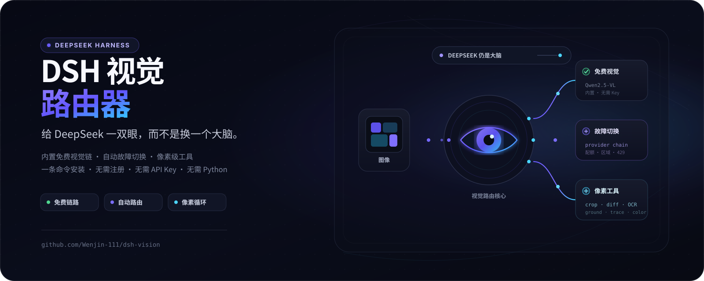
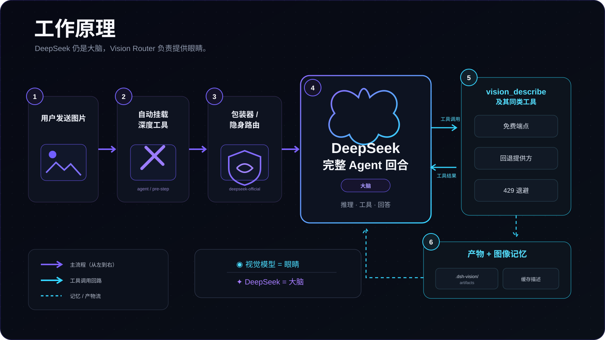
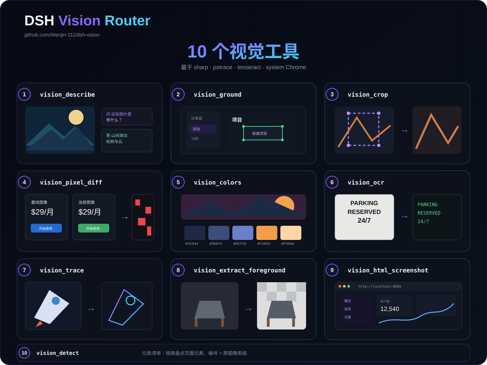

# dsh-vision-router

给 DeepSeek 一双眼，而不是换一个大脑。

`dsh-vision-router` 是 [DeepSeek Harness（DSH）](https://github.com/deepseek-ai) 的视觉路由插件：把对话里**带图的轮次**路由到视觉模型（带原始像素访问），**纯文字轮次**仍走会话自己的模型。内置一条免注册、免 Key 的免费视觉链路，带自动故障切换，并附带一套像素级视觉工具（看图问答、定位、裁剪、像素对比、取色、OCR、矢量化、抠图、页面截图）。

一条命令安装 · 无需注册 · 无需 API Key · 无需 Python




## 核心特性

- **按轮次视觉路由** —— 含图轮次（用户上传，或中途工具结果如 `read_image`）整轮跑在视觉模型上，其他轮次保持会话模型，DeepSeek 仍是「大脑」，只负责推理、工具、回答。
- **内置免费视觉链** —— 默认用 OVHcloud AI Endpoints 的 `Qwen2.5-VL-72B-Instruct`，匿名、免 Key、开箱即用；配置了 `httpProviders` 就自动覆盖默认。
- **自动故障切换** —— 视觉模型链按顺序回退（配额、区域、429 等），同一轮全部失败时抛出可分类、可行动的报错。
- **10 个像素级视觉工具** —— 基于 `sharp` / `potrace` / `tesseract` / 系统 Chrome，图片消息自动挂载，纯文字任务可手动 `vision_activate`。
- **图片自动压缩与缓存** —— 超过像素预算先缩放再送视觉模型；答案按「图片内容 + 问题」缓存（LRU + TTL）。
- **隐身模式** —— 接管官方 DeepSeek 路由，模型选择器保持原样。
- **按域名代理** —— 可选 `proxy` 只让 `proxyHosts` 里的域名走代理，其余（DeepSeek 等）保持直连。

## 工作原理



1. 用户发送图片。
2. 自动挂载深度视觉工具。
3. 包装器 / 隐身路由把图片轮交给视觉模型（agent / pre-step），纯文字轮仍走 `deepseek-official`。
4. DeepSeek 作为「大脑」完成完整 Agent 回合（推理 · 工具 · 回答）。
5. 需要看图时调用 `vision_describe` 及其同类工具，经免费端点 / 回退提供方（429 退避）得到文本结论。
6. 产物与图像记忆写入 `.dsh-vision-router/artifacts`，描述进缓存。

> ◉ 视觉模型 = 眼睛　✦ DeepSeek = 大脑

## 快速开始

```bash
dsh plugin add github:Wenjin-111/DSH-Vision
```

安装后重启 `dsh web`，即可在模型选择器里看到「自动识图」入口，或在 **设置 → 插件 → 插件配置 → 视觉路由** 里实时调整配置。默认即用内置免费视觉模型，无需任何注册或 Key。

### 可选：接入自己的视觉模型

把 `presets/` 下的任一片段合并进 `$DSH_HOME/settings.yaml`（填一个 `apiKeyEnv` 对应的 Key），然后在视觉路由卡片的「视觉模型链」里选中它即可。详见 [presets/README.md](presets/README.md)。

## 配置

所有配置项都可在 Web 设置卡里可视化修改（部分在「高级设置」里）。关键项：

| 配置项 | 默认值 | 说明 |
| --- | --- | --- |
| `provider` / `model` | `vision-http` / `ovh/Qwen2.5-VL-72B-Instruct` | 默认视觉模型（内置免费端点） |
| `providers` | `[]` | 视觉模型链，每行一个 `provider/model`，从上到下失败回退 |
| `fallbacks` | `[]` | 主视觉模型的回退列表 |
| `routing` | `false` | 是否开启「图片轮整轮自动路由」（默认关闭：图片轮像普通文本轮一样由会话模型调用视觉工具） |
| `reverseRouting` | `true` | 开启整轮路由时，纯文字轮反向路由回文本模型 |
| `stealth` | `true` | 隐身模式：接管官方 DeepSeek 路由 |
| `textProvider` | `deepseek-official` / `deepseek-v4-pro` | 文字轮使用的文本模型 |
| `tool` | `true` | 是否启用像素级视觉工具 |
| `downscale` / `downscaleMaxPixels` | `true` / `4000000` | 超过像素预算先缩放再送视觉模型 |
| `cache` / `cacheTtlSeconds` / `cacheMaxEntries` | `true` / `3600` / `200` | 视觉答案缓存（TTL / LRU 容量） |
| `timeoutMs` | `120000` | 单个视觉请求超时 |
| `proxy` / `proxyHosts` | `''` / 默认域名表 | 代理地址与「仅走代理的域名」 |
| `artifactsDir` | `.dsh-vision-router/artifacts` | 视觉工具产物目录 |
| `freeFallback` | `true` | 未显式配置 `httpProviders` 时启用内置免 Key 免费端点兜底 |

> 说明：默认关闭 `routing`，图片轮不会整轮切到视觉模型，而是由会话模型调用视觉工具看图，可连续多步操作（定位 → 裁剪 → 对比 …）。开启后恢复旧的整轮一次性自动识图行为，此时降级链只包含视觉模型链里的 provider+fallbacks，`httpProviders`（含免费兜底）不参与。

## 视觉工具

图片消息会自动挂载以下工具；纯文字任务可调用 `vision_activate` 手动挂载。产物写入 `artifactsDir`，坐标均为原图像素。

| 工具 | 用途 |
| --- | --- |
| `vision_describe` | 看图问答：把 1–4 张图转成文本结论，支持多图对比与 `json` 结构化输出 |
| `vision_ground` | 像素定位：给出目标（如「发送按钮」）的像素框，可回写标注图 |
| `vision_detect` | 元素清单：列出交互元素并编号加框，可引用「元素 #n」 |
| `vision_crop` | 裁剪放大：按 `x1,y1,x2,y2` 裁出局部细看 |
| `vision_pixel_diff` | 像素对比验证：比较基线图与还原图（还原类任务验证用） |
| `vision_colors` | 取色：提取主色（数量可选） |
| `vision_ocr` | 文字识别：本地 tesseract 优先，视觉模型兜底 |
| `vision_trace` | SVG 矢量化：位图转矢量（potrace，可选彩色） |
| `vision_extract_foreground` | 抠图：flood-fill 去纯色背景 |
| `vision_html_screenshot` | 页面截图：本地 HTML 用系统 Chrome 渲染截图 |



## 供应商预设

`presets/` 提供即插即用片段（合并进 `settings.yaml` 的 `llm-pi-ai` 段，填 Key 即可；仓库**绝不内置任何第三方 Key**）：

| 文件 | 供应商 | 说明 |
| --- | --- | --- |
| `dashscope.yaml` | 阿里云百炼 | 大陆直连，新用户每系列 100 万 token/90 天（推荐首选） |
| `zhipu.yaml` | 智谱 bigmodel.cn | `glm-4.6v-flash` 永久免费 |
| `siliconflow.yaml` | 硅基流动 | ¥14 赠金覆盖 Qwen2.5-VL |
| `openrouter.yaml` | OpenRouter | 免费模型（50 次/天，名单会轮换） |
| `ovh.yaml` | OVHcloud AI Endpoints | 免账号免 Key，匿名额度 2 次/分钟/IP（已内置为默认） |

## 代理

如需访问部分海外 AI API，可在视觉路由卡片里设置 `proxy`（如 `http://127.0.0.1:10808` 或 `socks5h://127.0.0.1:10808`）。只有 `proxyHosts` 里的域名会走代理，其余（含 DeepSeek 本身）保持直连。默认代理域名表：OpenRouter、OpenAI、Anthropic、Groq、Mistral、Together、Google Gemini、xAI。

## 开发

```bash
pnpm install
pnpm test   # node --test tests/core.test.js tests/client.test.js
```

要求 Node ≥ 22。插件分两半：宿主侧 `index.js`（路由、工具、适配器），浏览器侧 `lib/client.js`（设置 → 插件 → 插件配置 的设置卡，无 bundler，手写自包含）。

## 许可证

[LGPL-3.0](LICENSE)
